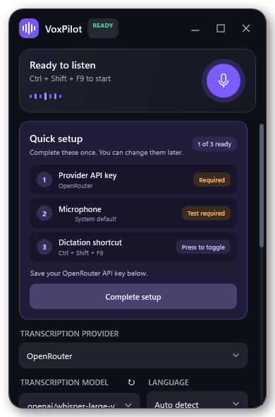

# VoxPilot

VoxPilot is a compact Windows voice-to-text app that records the default microphone, sends a WAV recording to either OpenAI or OpenRouter for transcription, and can type the result into the application that was active when dictation started.



## Features

- Small always-on-top controller with a draggable custom title bar
- Standard minimize, maximize/restore, and close controls
- Recoverable from both the Windows taskbar and the VoxPilot notification-area icon
- Live microphone-level visualization and clear ready/listening/working/standby states
- Selectable OpenAI or OpenRouter transcription provider
- Separate API keys stored securely for each provider
- Native OpenAI transcription through `POST /v1/audio/transcriptions`
- OpenRouter transcription through `POST /api/v1/audio/transcriptions`
- Provider-specific transcription models plus editable model IDs
- Dedicated transcription-model filtering (general audio-chat models are excluded)
- Automatic language detection or a manual language hint
- Unicode text injection into the previously focused Windows application
- Configurable global shortcuts for dictation and standby
- System tray controls, optional start with Windows, clipboard copy, and silence stop
- No-focus animated waveform widget when dictating while minimized or hidden
- API key storage in Windows Credential Manager (never in `settings.json`)

## Default shortcuts

- **Ctrl + Shift + F9:** start or stop dictation
- **Ctrl + Shift + F10:** enter standby or resume

Both can be changed under **Settings & shortcuts**.

## Build

Requires Windows and the .NET 10 SDK.

```powershell
dotnet build VoiceFlow.csproj -c Release
dotnet run --project VoiceFlow.csproj -c Release
```

To create the self-contained, single-file Windows build:

```powershell
dotnet publish VoiceFlow.csproj -c Release -r win-x64 --self-contained true `
  -p:PublishSingleFile=true -p:IncludeNativeLibrariesForSelfExtract=true
```

## Usage notes

1. Choose **OpenAI** or **OpenRouter** as the transcription provider.
2. Enter that provider's API key and select **Save key**.
3. Choose an audio/transcription model and language.
4. Switch to the app where text should appear.
5. Press the dictation shortcut, speak, then press it again.

For the most reliable anywhere-typing workflow, leave the caret in the destination app and use the global shortcut without clicking VoxPilot. If you use VoxPilot's microphone button, it remembers and restores the application directly beneath it before typing.

Drag anywhere in the empty title-bar area to move VoxPilot. The minimize button keeps it in the Windows taskbar; double-click the purple tray icon if you hide or lose sight of the window.

Windows prevents a normal app from injecting input into an administrator-elevated app. For security, microphone audio is held in memory and sent only to the selected provider when recording stops; VoxPilot does not save recordings to disk.

## OpenAI Build Week

VoxPilot was developed during OpenAI Build Week with Codex and GPT-5.6 as the primary engineering collaboration environment.

### How we collaborated with Codex

Codex and GPT-5.6 helped turn the product direction into a working Windows application by:

- Scaffolding and iterating on the .NET/WPF architecture
- Implementing microphone capture, transcription-provider clients, secure credential storage, global hotkeys, system-tray behavior, and Unicode text injection
- Diagnosing Windows focus and privilege-boundary behavior
- Rendering visual previews and refining the compact controller and no-focus dictation widget
- Adding separate OpenAI and OpenRouter provider paths while preserving provider-specific keys and model choices
- Building and validating the self-contained Windows distribution

The entrant directed the core product decisions: a native Windows experience instead of a browser app, typing into the previously focused application, memory-only audio handling, Windows Credential Manager for secrets, configurable global shortcuts, a compact always-on-top interface, and support for multiple transcription providers. Codex accelerated implementation and debugging; the entrant selected the behavior, privacy boundaries, product scope, and final experience.

### Development evidence

- The source repository contains a timestamped commit from the hackathon submission period.
- The Devpost submission will include the `/feedback` Codex Session ID from the task where most core functionality was built.
- The demo video will show the working product and briefly explain how Codex and GPT-5.6 contributed.

## Testing the packaged app

VoxPilot supports Windows 10/11 on x64 hardware. Judges can test it without rebuilding:

1. Download and extract the `VoxPilot-win-x64.zip` release.
2. Run `VoxPilot.exe`.
3. Select OpenAI or OpenRouter and save a compatible API key.
4. Focus a text editor.
5. Press **Ctrl + Shift + F9**, speak, then press the shortcut again.
6. Confirm that the transcript appears in VoxPilot and is typed into the editor.

The API key is stored in Windows Credential Manager and is never written to the repository or `settings.json`. Audio remains in memory and is sent only to the provider selected by the tester.
